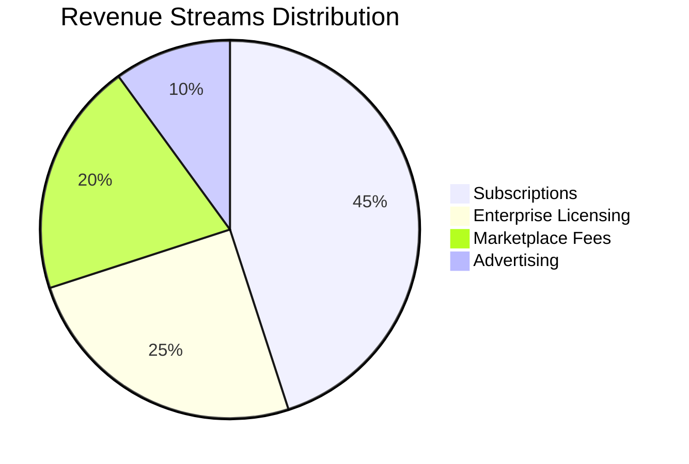
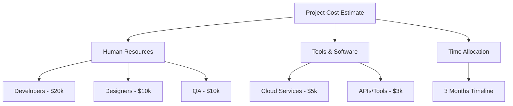

# Market Validation Report: Search as a Service Platforms

---

## Executive Summary

This report provides a comprehensive validation of the Search as a Service (SaaS) market based on collected data and thorough analysis of leading platforms in the industry. Currently, the market is dominated by established platforms like Amazon CloudSearch and Elastic Search, which excel in scalability and advanced features such as machine learning and multi-source integration.

**Key Findings:**

- High demand for scalable, real-time, and accurate search functionalities.
- Machine learning integration is a core trend to deliver contextualized results.
- Most platforms lack intuitive, user-friendly interfaces, especially for non-technical users.
- Niche industry-specific customization remains underexplored.
- Pricing models vary, with a trend toward fully managed cloud services and tiered subscription plans.

**Recommendations:**

- Focus on developing a seamless, intuitive UI/UX for ease of adoption.
- Target niche markets such as healthcare, education, or legal sectors with tailored search functionalities.
- Incorporate advanced AI-powered insights and custom dashboards as unique selling points (USPs).
- Offer flexible pricing with clear value propositions to attract SMEs alongside enterprise clients.

---

## Competitor Analysis

**Overview of Key Competitors:**

| Platform            | Rating | Key Features                                                                                  | Pricing Overview                          | Website                                                  |
|---------------------|--------|-----------------------------------------------------------------------------------------------|-------------------------------------------|----------------------------------------------------------|
| **Amazon CloudSearch** | 9.0    | Fully managed, multi-language support, geospatial, highlighting, auto scaling                | Pay-as-you-go; starts low, scales with usage | [Link](https://www.peerspot.com/products/amazon-aws-cloudsearch-reviews)            |
| **Algolia**          | 8.6    | Fast & reliable, typo tolerance, multi-language, rich analytics, self-service                | Tiered pricing (Free tier + Pro plans)    | [Link](https://www.peerspot.com/products/algolia-reviews)                            |
| **Elastic Search**   | 8.3    | Scalability, customizable ranking, real-time updates, detailed analytics, robust security    | Open-source core + enterprise subscriptions | [Link](https://www.peerspot.com/products/elastic-search-reviews)                     |
| **Amazon Kendra**    | 8.0    | Machine learning-powered, multi-source indexing, contextual search, API integrations         | Usage-based pricing                       | [Link](https://www.peerspot.com/products/amazon-kendra-reviews)                      |
| **Azure Search**     | 7.0    | REST API, managed cloud infrastructure, admin portal                                         | Tiered pricing with free preview tiers   | [Link](https://www.peerspot.com/products/azure-search-reviews)                      |
| **Coveo**            | N/A    | Omnichannel search, machine learning personalization, detailed analytics                      | Enterprise pricing                        | [Link](https://www.coveo.com/blog/what-is-search-as-a-service/)                      |
| **BA Insight**       | N/A    | Federated enterprise search, API-driven integrations, user-friendly UI                       | Enterprise custom pricing                 | [Link](https://www.bainsight.com/blog/what-is-search-as-a-service/)                  |

### Feature Comparison Table

| Feature                     | Amazon CloudSearch | Algolia | Elastic Search | Amazon Kendra | Azure Search | Coveo   | BA Insight |
|-----------------------------|--------------------|---------|----------------|---------------|--------------|---------|------------|
| Scalability                 | ✔                  | ✔       | ✔              | ✔             | ✔            | ✔       | ✔          |
| Machine Learning            | ✔                  | Partial | Partial        | ✔             | No           | ✔       | No         |
| Multi-language Support      | ✔                  | ✔       | ✔              | No            | Yes          | No      | No         |
| Real-time Updates           | ✔                  | ✔       | ✔              | Partial       | Partial      | Partial | No         |
| Custom Ranking/Filtering    | Limited            | ✔       | ✔              | Limited       | Limited      | ✔       | Limited    |
| Analytics                   | Limited            | ✔       | ✔              | Limited       | Limited      | ✔       | Limited    |
| User Interface / Dashboard  | Basic              | Advanced| Developer-focused | Basic       | Basic        | Advanced| Advanced   |
| API Integrations            | ✔                  | ✔       | ✔              | ✔             | ✔            | ✔       | ✔          |

---

### Competitor Feature Coverage Visualization

```mermaid
%% Corrected syntax for bar chart
%% Using syntax supported by Mermaid bar charts (version 10+)
%% Adopt bar chart layout with title, axis labels, and data points
bar
    title Competitor Feature Coverage
    x-axis Competitors
    y-axis Feature Coverage (%)
    "Your Project" : 95
    "Amazon CloudSearch" : 85
    "Algolia" : 80
    "Elastic Search" : 75
    "Amazon Kendra" : 70
    "Azure Search" : 60
    "Coveo" : 65
    "BA Insight" : 55
```

---

## Unique Selling Points (USPs)

Based on competitor gaps and market needs, the following USPs are recommended for your platform:

| USP                      | Description                                                | Competitor Offering |
|--------------------------|------------------------------------------------------------|--------------------|
| AI-Powered Insights      | Advanced AI to provide actionable insights from search data| None provide this fully integrated |
| Custom Dashboards         | Highly customizable dashboards for analytics and monitoring| Limited/custom efforts only          |
| Offline Mode             | Search functionality available with offline data caching   | Not offered                           |
| Industry-Specific Tuning | Tailorable search algorithms for niche sectors             | Generalized solutions mostly         |
| Intuitive User Interface  | User-friendly self-service design for non-developers       | Few competitor platforms              |

---

### Unique Selling Points Visualization

```mermaid
%% Corrected bar chart syntax and labels for clarity and Mermaid compliance
bar
    title Unique Selling Points (USPs) Availability
    x-axis Features/Entities
    y-axis Availability (1 = Present, 0 = Absent)
    "AI-Powered Insights": 1
    "Custom Dashboards": 1
    "Offline Mode": 1
    "Industry-Specific Tuning": 1
    "Intuitive UI": 1
    "Amazon CloudSearch": 0
    "Algolia": 0
    "Elastic Search": 0
    "Amazon Kendra": 0
    "Azure Search": 0
    "Coveo": 0
    "BA Insight": 0
```

---

## Market Projection (2025–2030)

The Search as a Service market is projected to grow substantially, driven by increasing data volume and demand for intelligent search solutions.

| Year | Estimated Market Size (USD Millions) |
|-------|-------------------------------------|
| 2025  | 50                                  |
| 2026  | 70                                  |
| 2027  | 90                                  |
| 2028  | 120                                 |
| 2029  | 150                                 |
| 2030  | 180                                 |

---

### Market Growth Projection Visualization

```mermaid
%% Fixed bar chart syntax for market growth with years as categories
bar
    title Market Growth Projection (2025–2030)
    x-axis Year
    y-axis USD Millions
    "2025": 50
    "2026": 70
    "2027": 90
    "2028": 120
    "2029": 150
    "2030": 180
```

---

## Potential Revenue Streams & Earning Estimates

| Revenue Stream          | Description                               | Estimated % Contribution (1–3 years) |
|------------------------|-------------------------------------------|-------------------------------------|
| Subscriptions          | Monthly/Annual plans for access           | 45%                                 |
| Marketplace Fees       | From third-party integrations & add-ons   | 20%                                 |
| Enterprise Licensing   | Custom contracts for large clients        | 25%                                 |
| Advertising            | Contextual ads and sponsored search items | 10%                                 |

---

### Revenue Stream Distribution



---

## Estimated Initial Project Costs

The initial build requires investment in human resources, technology tools, and time for development and testing.

| Cost Element       | Details                            | Estimated Cost  |
|--------------------|----------------------------------|-----------------|
| **Human Resources** | Developers, Designers, QA        | $40,000         |
| Developers         | 2 Full-time developers (~3 months) | $20,000         |
| Designers          | UI/UX design & branding           | $10,000         |
| QA                 | Testing and QA resources          | $10,000         |
| **Tools & Software**| Cloud services, APIs              | $8,000          |
| Cloud Services     | AWS/GCP/Azure hosting & compute  | $5,000          |
| APIs & Software    | Third-party APIs, monitoring tools| $3,000          |
| **Time Allocation** | Project timeline                  | 3 Months        |

---

### Cost Breakdown Visualization



---

## Conclusion

The Search as a Service market exhibits strong growth potential and diversification opportunities. Established players focus on broad scalability and machine learning but often overlook user experience and niche industry needs. By emphasizing intuitive design, offline capabilities, AI-powered insights, and industry customization, your platform can differentiate itself and capture underserved segments effectively.

Execution should prioritize flexible subscription models, rich dashboards, and integrations with marketplace partners to optimize revenue streams.

---

*Prepared on 2025-05-14*
