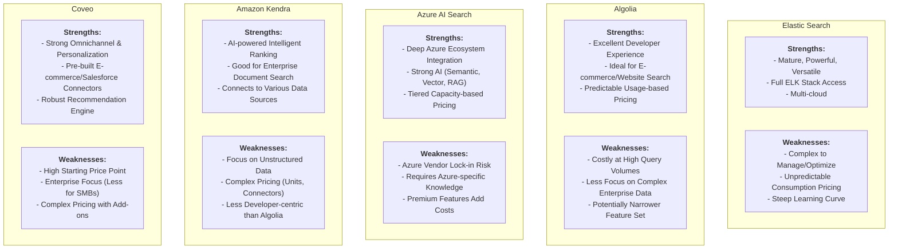

# Market Validation Report: Search as a Service Project

**Date:** 2025-05-14

## Executive Summary

This report provides a market validation for the "Search as a Service" project, designed to offer search results capabilities, with a potential focus on marketplace product searches. The Search as a Service market is experiencing robust growth, projected to expand from **USD 5.62 billion in 2024 to USD 20.57 billion by 2033 (15.9% CAGR)**. This growth is fueled by increasing digital transformation, the rising volume of enterprise data, and the demand for AI/ML-enhanced productivity tools.

Key competitors like Elastic Search, Algolia, Azure AI Search, Amazon Kendra, and Coveo offer a diverse range of features and complex pricing models. Our analysis reveals significant market opportunities, particularly in:
*   **Niche Specialization:** Focusing on underserved areas like marketplace product search.
*   **Pricing Simplicity:** Offering transparent and predictable pricing models.
*   **Developer Experience:** Providing superior ease of use and integration.
*   **Targeted AI/ML:** Leveraging AI/ML for specific e-commerce needs.
*   **Scalable Performance:** Ensuring high performance for large-scale product catalogs.

**Key Recommendations:**
1.  **Focus on Marketplace Niche:** Develop the "Search as a Service" project with a primary focus on marketplace product search, tailoring features to e-commerce needs.
2.  **Develop Clear USPs:** Emphasize unique selling points such as simplified pricing, superior developer experience, specialized e-commerce AI/ML, and guaranteed performance for large catalogs.
3.  **Strategic Pricing:** Implement a transparent and predictable pricing model that appeals to small and medium-sized marketplaces initially.
4.  **Phased Investment:** Manage initial costs (estimated $900k - $2.5M+ for 12-18 months) by focusing on an MVP and iterating based on market feedback.
5.  **Monitor Market Trends:** Continuously adapt to evolving AI/ML capabilities and customer demands in the dynamic search market.

This report details the market landscape, competitive environment, potential revenue streams, and initial cost estimations to support strategic decision-making for the project.

## 1. Introduction

This document outlines the market validation for the "Search as a Service" project. The project aims to develop a service that provides robust search result capabilities, with a specific opportunity identified in serving marketplace product searches. This report analyzes the market viability, competitive landscape, and financial considerations for this venture.

## 2. Market Overview

### 2.1. Market Size and Growth Trends

The Search as a Service market is dynamic and poised for significant expansion:
*   The global **Search as a Service Market** was valued at approximately **USD 5.62 billion in 2024**.
*   It is projected to reach **USD 20.57 billion by 2033**, growing at a Compound Annual Growth Rate (CAGR) of **15.9%** from 2026 to 2033.
*   The related **Enterprise Search Market** is also demonstrating healthy growth, expected to increase from **USD 5.38 billion in 2025** to **USD 10.50 billion by 2034**, at a CAGR of **7.71%**.

These figures indicate a strong and growing demand for advanced search solutions across various industries.

### 2.2. Key Market Drivers

Several factors are fueling the growth of the Search as a Service market:
*   **Increasing Digital Transformation:** Businesses are increasingly moving their operations and data online, necessitating effective search functionalities.
*   **Rising Volume of Enterprise Data:** The exponential growth of data within organizations requires powerful tools for efficient information retrieval.
*   **Demand for Improved Productivity:** Effective search solutions enhance employee productivity and improve customer experience.
*   **AI/ML Integration for Enhanced Search:** Artificial Intelligence and Machine Learning are being heavily integrated to provide more relevant, personalized, and intelligent search results (e.g., semantic search, RAG optimization, vector search).
*   **Integration with Collaboration Tools:** Seamless integration of search capabilities within existing business workflows and collaboration platforms is becoming standard.
*   **Emergence of New Service Models:** The "as a Service" delivery model lowers entry barriers for businesses, allowing access to sophisticated search technology without significant upfront infrastructure investment.

## 3. Competitor Analysis

### 3.1. Overview of Key Competitors

The Search as a Service market features several established players:
1.  **Elastic Search:** A versatile and powerful open-source based search and analytics engine.
2.  **Algolia:** Known for its developer-friendly platform and speed, particularly popular for e-commerce and website search.
3.  **Azure AI Search (formerly Azure Search):** Microsoft's cloud-based search service with strong AI capabilities.
4.  **Amazon Kendra:** AWS's AI-powered enterprise search service, focused on natural language understanding.
5.  **Coveo:** An AI-powered search and recommendations platform, often targeting enterprise and e-commerce solutions.

### 3.2. Feature Comparison

| Competitor        | Key Features                                                                                                                                                              |
| :---------------- | :------------------------------------------------------------------------------------------------------------------------------------------------------------------------ |
| **Elastic Search** | Multi-tenant architecture, analytics engine, full-text and distributed search, website search, enterprise search, log analytics, ELK Stack access, generative AI, security. Available on AWS, Azure, Google Cloud. |
| **Algolia**        | Scalable search, analytics, NLP, A/B testing, AI features (NeuralSearch), merchandising studio, global hosting, search API.                                               |
| **Azure AI Search**| Information retrieval, RAG optimization for Gen AI, store/index/search own data, semantic ranking, vector and hybrid search, AI enrichment (built-in/custom skills).         |
| **Amazon Kendra**  | AI-powered search, intelligent ranking, connects to various data sources. Developer and Enterprise editions.                                                               |
| **Coveo**          | Omnichannel search, recommendations, content personalization, unified index, cloud connectors, rules engine, deep learning, extensions for Ecommerce, Self-Service, Agent Assist. Pre-built integrations. |

### 3.3. Pricing Plan Comparison

| Competitor        | Pricing Model / Key Plans                                                                                                                                                              |
| :---------------- | :------------------------------------------------------------------------------------------------------------------------------------------------------------------------------------- |
| **Elastic Search** | Resource consumption-based (memory, storage, data transfer, features). Elastic Cloud starts at $95+/month. Platinum plan (full ELK Stack) from $125/month. Varies by cloud provider/configuration. |
| **Algolia**        | Free 'Build' plan (10k search requests/month, 1M records). 'Grow' plan: pay-as-you-go ($0.40/additional 1k requests, $0.50/additional 1k requests beyond free tier). 'Premium' & 'Elevate': annual billing, volume discounts. Enterprise: custom. Usage-based (per 1k searches). |
| **Azure AI Search**| Tier-based (Free, Basic, Standard S1-S3, Storage Optimized L1-L2) based on storage/capacity. Flat hourly rate (capacity units - SUs). Premium features (semantic ranking, AI enrichment) additional cost (e.g., per 1k requests/transactions). Free tier & daily processing limits for some features. |
| **Amazon Kendra**  | Developer Edition: $1.125/hour ($810/month). Enterprise Edition: from $1.40/hour ($1,008/month). Includes costs for storage units, query units, connectors. Varies by edition, provisioned storage, query capacity. Intelligent Ranking separate pricing (query volume). |
| **Coveo**          | 'Base': $600/month (1 site/catalog, 100k queries/month). 'Pro': $1,320/month (multi-site/source, 100k queries/month). 'Enterprise': custom (volume-based, 200k queries/month included). Query upgrades available. Salesforce integration: $990-$2,400/month. |

### 3.4. Competitor Strengths and Weaknesses (Table)

| Competitor          | Strengths                                                                                                | Weaknesses                                                                                                   |
| :------------------ | :------------------------------------------------------------------------------------------------------- | :----------------------------------------------------------------------------------------------------------- |
| **Elastic Search**  | Mature, powerful, versatile (log analysis, enterprise search); Full ELK stack access; Multi-cloud presence. | Can be complex to manage/optimize; Consumption-based pricing can be unpredictable; Learning curve for full ELK. |
| **Algolia**         | Strong focus on developer experience & ease of use; Excellent for website/e-commerce search; Usage-based pricing predictability (per search). | Pricing can become expensive at high query volumes; Less emphasis on complex enterprise data sources than others; Feature set might be less broad than Elastic. |
| **Azure AI Search** | Deep integration with Azure ecosystem; Strong AI features (semantic, vector, RAG); Tiered capacity-based pricing. | Primarily Azure-bound (vendor lock-in risk for multi-cloud users); AI features might require specific Azure knowledge; Pricing can add up with premium features. |
| **Amazon Kendra**   | AI-powered intelligent ranking; Good for enterprise document search; Connects to various data sources.         | More focused on unstructured/document search than structured product data; Pricing can be complex (units, connectors); Less developer-focused than Algolia. |
| **Coveo**           | Strong in omnichannel experience, personalization, recommendations; Pre-built connectors/extensions (especially for Salesforce, E-commerce). | Higher starting price ($600/month); Enterprise focus might make it less accessible for smaller businesses; Pricing structure can be complex with add-ons. |

### 3.5. Competitor Strengths and Weaknesses (Chart)



## 4. Market Gaps and Opportunities

Analysis of the market and competitor landscape reveals several gaps and opportunities for a new "Search as a Service" project:

*   **Niche Specialization (e.g., Marketplace Product Search):** Many existing solutions offer general-purpose search. A service specifically optimized for marketplace product search (advanced filtering, variant handling, merchandising rules, e-commerce platform integrations) could capture a dedicated market segment.
*   **Pricing Complexity and Predictability:** Some competitors have complex or unpredictable pricing models (e.g., resource consumption-based). There's an opportunity for simpler, transparent, and predictable pricing structures that resonate better with businesses, especially SMBs.
*   **Ease of Use and Integration:** While some platforms are developer-friendly, simplifying the integration process further, offering extensive SDKs, pre-built connectors for popular e-commerce platforms (Shopify, Magento, WooCommerce), and intuitive management dashboards can be a significant differentiator.
*   **Specific AI/ML Focus for E-commerce:** Competitors are broadly adopting AI/ML. An opportunity lies in developing and highlighting AI/ML features specifically tailored to e-commerce challenges, such as automated product attribute extraction, visual search, dynamic pricing considerations in search, or AI-driven merchandising.
*   **Performance and Scalability for Large Product Catalogs:** Marketplaces often deal with large, dynamic product inventories. Guaranteeing high performance, low latency, and seamless scalability for such catalogs can be a compelling value proposition.

## 5. Recommended Unique Selling Points (USPs)

Based on the market analysis, the following USPs are recommended for the "Search as a Service" project, particularly if targeting the marketplace niche:

1.  **Optimized for Marketplace Product Search:** Deliver out-of-the-box features tailored for e-commerce, including sophisticated filtering/faceting for product attributes, robust variant handling, seamless integration with product data feeds, and intuitive merchandising tools.
2.  **Simplified & Predictable Pricing:** Offer a clear, tiered pricing model that is easy for businesses to understand and predict, potentially based on indexed product volume, query volume, or a combination, avoiding hidden costs.
3.  **Superior Developer Experience & Rapid Integration:** Focus on providing easy-to-use APIs, comprehensive documentation, SDKs for popular e-commerce platforms and programming languages, and a streamlined setup process.
4.  **Built-in E-commerce AI/ML Power:** Integrate advanced AI features directly relevant to enhancing product discovery and conversion, such as AI-powered automated product tagging, image-based search capabilities, AI-driven personalized recommendations within search, and intelligent query understanding for e-commerce terms.
5.  **Guaranteed Performance & Scalability for Large Catalogs:** Engineer the service to deliver demonstrable high performance (low latency, high throughput) and effortless scalability, specifically designed to handle large and frequently updated product inventories typical of marketplaces.

## 6. Market Projection (3-5 Years)

The Search as a Service market is projected for strong growth. Using the overall market CAGR of 15.9% and the 2024 valuation of $5.62 billion, the following 5-year projection illustrates the potential market expansion:

### 6.1. Projected Market Size (Chart)

```mermaid
lineChart
    title Search as a Service Market Projection (USD Billions)
    xConfig={
        "title": "Year"
    }
    yConfig={
        "title": "Market Size (USD Billions)"
    }
    Data
    2024: 5.62
    2025: 6.51
    2026: 7.54
    2027: 8.74
    2028: 10.13
    2029: 11.74
```
*Note: Projections for 2025-2029 are calculated using the 15.9% CAGR from the 2024 base value of $5.62B. The provided CAGR of 15.9% is for 2026-2033, applied here for illustrative forward projection.*

## 7. Potential Revenue Streams and Earning Potential (1-3 Years)

### 7.1. Revenue Streams

The project can generate revenue through multiple streams:

*   **Subscription Tiers:** Offering tiered monthly/annual plans (e.g., Basic, Pro, Enterprise) based on factors like the number of indexed products/SKUs, monthly search query volume, and feature access.
*   **Usage-Based Overages:** Charging for consumption exceeding tier limits (e.g., per 1,000 additional search queries or indexed items).
*   **Premium Feature Add-ons:** Offering advanced functionalities like specialized AI/ML modules (e.g., advanced personalization, visual search), dedicated support, or custom integrations at an additional cost.
*   **Custom Enterprise Solutions:** Providing tailored packages, including custom development, dedicated infrastructure, and SLAs for large enterprise clients with unique requirements.

### 7.2. Estimated Revenue Potential (Chart)

The following chart illustrates a high-level cumulative revenue potential for the first three years, assuming successful market entry and customer acquisition, particularly focusing on small to medium-sized marketplaces.

```mermaid
barChart
    title Estimated Cumulative Revenue Potential (Years 1-3)
    xConfig={
        "title": "Year",
        "labelRotation": 0
    }
    yConfig={
        "title": "Cumulative Revenue (USD Millions)"
    }
    labels: ["Year 1", "Year 2 (Cumulative)", "Year 3 (Cumulative)"]
    datasetMin:
        label: "Min Estimated Revenue"
        data: [0.12, 1.2, 4.8]
    datasetMax:
        label: "Max Estimated Revenue"
        data: [0.6, 5.4, 18.0]
```

*   **Year 1:** $120,000 - $600,000
*   **Year 2 (Cumulative):** $1.2 million - $5.4 million
*   **Year 3 (Cumulative):** $4.8 million - $18 million

*Disclaimer: These are high-level estimates and actual revenue will depend on market adoption, pricing strategy, sales execution, customer acquisition cost (CAC), customer lifetime value (CLTV), and churn rate.*

## 8. Estimated Initial Project Costs

Developing and launching the "Search as a Service" project will incur initial costs primarily in human resources, tools, and infrastructure.

### 8.1. Cost Breakdown (Diagram)

```mermaid
mindmap
  root((Initial Project Costs ($900k - $2.5M+ for 12-18 months)))
    ::icon(fa fa-dollar-sign)
    Human Resources ($800,000 - $2,000,000 over 18 months)
      ::icon(fa fa-users)
      Team Composition
        - 5-8 Engineers (Backend, Frontend, DevOps, Search/AI)
        - 1-2 Product Managers
        - 1 UX/UI Designer
        - 1-2 Management/Leadership
    Tools & Infrastructure ($100,000 - $500,000 over 18 months)
      ::icon(fa fa-cogs)
      Key Components
        - Cloud Infrastructure (Servers, DBs, Storage, Search Infra)
        - Development & CI/CD Tools
        - Collaboration & Project Management Software
        - Monitoring, Logging & Analytics Tools
    Time to MVP (Minimum Viable Product)
      ::icon(fa fa-clock)
      - Estimated 9-15 months for initial development and launch
```

**Summary of Estimated Initial Costs:**
*   **Human Resources (18 months):** $800,000 - $2,000,000 (covering a core team of 5-8 engineers, 1-2 PMs, 1 Designer, 1-2 Management roles).
*   **Tools & Infrastructure (18 months):** $100,000 - $500,000 (for cloud services, development software, operational tools).
*   **Time to MVP:** Approximately 9-15 months.
*   **Overall Initial Cost (12-18 months):** Estimated between **$900,000 and $2,500,000+**. This wide range depends on team size, location, experience, infrastructure choices, and development velocity.

## 9. Conclusion

The "Search as a Service" market presents a compelling opportunity, driven by strong growth and evolving business needs for sophisticated search solutions. While the competitive landscape is active, strategic differentiation through a focus on marketplace product search, simplified pricing, superior developer experience, and specialized e-commerce AI/ML features can carve out a successful niche.

The project has substantial revenue potential, but it requires significant initial investment in talent and technology. A phased approach, starting with a well-defined MVP targeting a specific segment of the marketplace niche, is recommended to validate assumptions and iterate effectively. By capitalizing on the identified market gaps and leveraging the recommended USPs, the "Search as a Service" project can position itself for sustainable growth and success.
