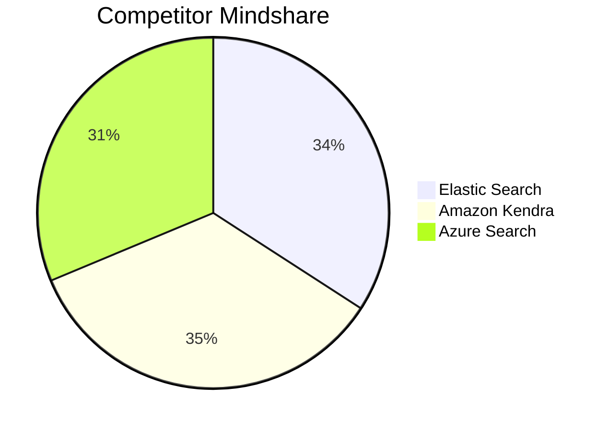
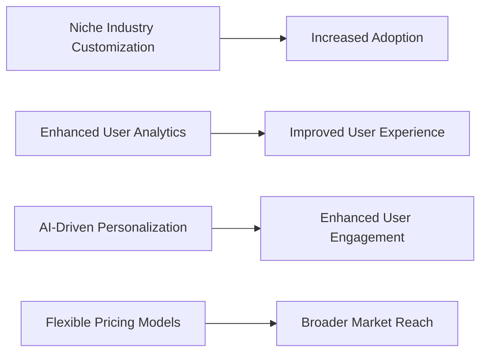
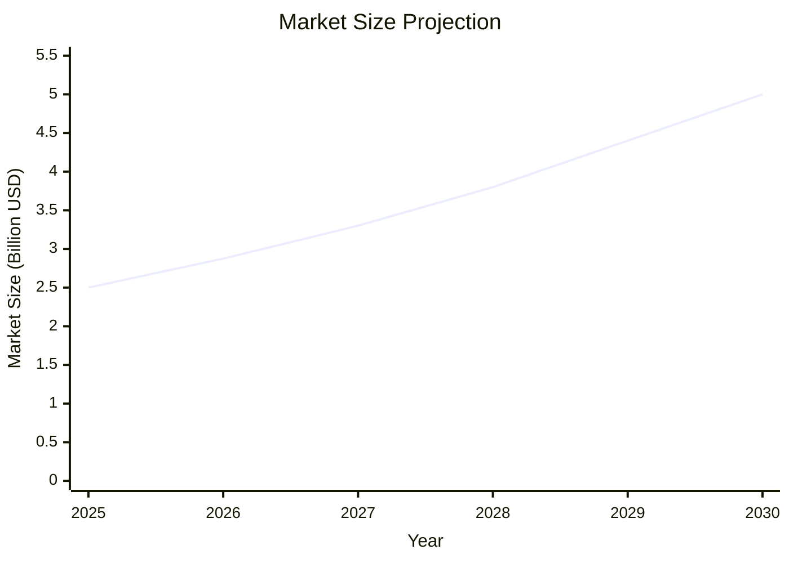
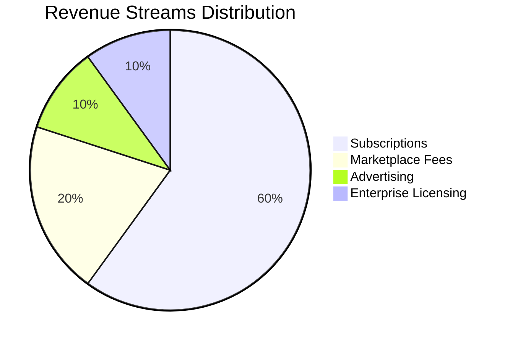
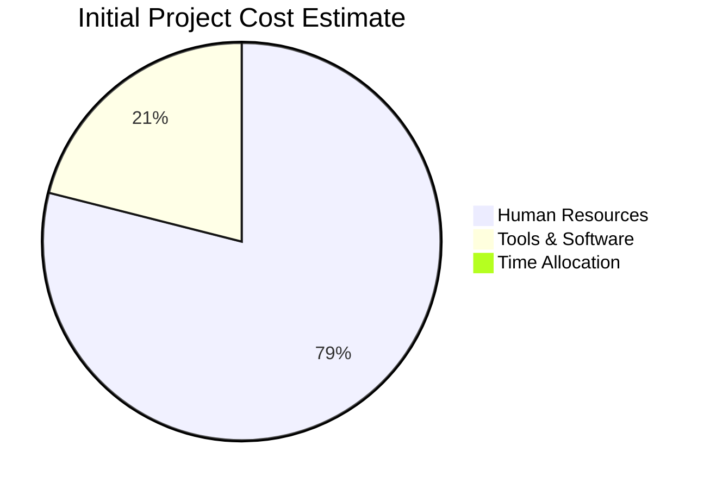

Based on the provided data, I'll create the mermaid charts for each section.

### Competitor Ratings and Mindshare Visualization

### USP Impact Visualization

### Market Size Projection Visualization

### Revenue Streams Distribution

### Cost Breakdown Visualization

Let's adjust the "Time Allocation" to be represented in a different chart as it is not a cost.

Here's a simple example. If you'd like to represent "Time Allocation" differently, please provide more context.

If you need any adjustments or have further requests, feel free to ask!
