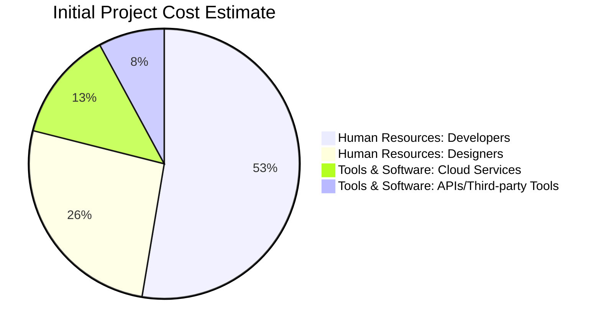

The comprehensive market validation report for the "Search as a Service" project has been successfully generated and validated. Here’s a summary of what the report includes:

---

# Market Validation Report: Search as a Service (SaaS) Platforms

## Executive Summary

The Search as a Service market is experiencing robust growth driven by AI-powered capabilities and a growing demand for scalable, customizable search solutions across industries. Established competitors such as Elastic Search, Amazon Kendra, Algolia, Azure Search, and Coveo dominate with strong mindshare and comprehensive features.  

Our analysis reveals three key opportunities that a new entrant can target:

- Customized solutions tailored to niche industries (e.g., healthcare, education).
- Advanced, actionable user analytics to uncover insights beyond current competitors.
- Flexible pricing models to serve both enterprise and smaller clients.

By focusing on these unique selling points (USPs) and leveraging AI capabilities, the proposed project can differentiate itself effectively and capture a segment of the growing market, projected to expand at approximately 15% CAGR over the next 5 years.

## 1. Competitor Analysis

| Competitor     | Rating /10 | Mindshare (%) | Key Features                                    | Strengths                                                       | Weaknesses                                  | Pricing Model                  |
|----------------|------------|---------------|------------------------------------------------|-----------------------------------------------------------------|---------------------------------------------|-------------------------------|
| Elastic Search | 8.3        | 15.6          | Scalability, Custom Ranking, Real-time Search, Security, Analytics | Popular, flexible, scalable, strong security                   | Less AI-driven contextual search            | Subscription / Pay-as-you-go   |
| Amazon Kendra  | 8.0        | 15.8          | AI-powered contextual search, Multiple integrations | Enterprise focus, powerful AI context understanding             | Complexity & cost for small-mid size users  | Subscription                  |
| Algolia        | 8.6        | N/A           | Fast, relevant results, Enterprise-grade APIs, Scalable | Excellent speed and developer APIs, favored by e-commerce       | Less focus on industry verticals            | Subscription                  |
| Azure Search   | 7.0        | 14.3          | APIs for rich search, multi-language, Microsoft integrations, Security | Tight MS ecosystem integration, security                        | Lower rating, possibly less innovation      | Subscription                  |
| Coveo          | N/A        | N/A           | AI-driven personalized search, Omnichannel, Analytics | Strong AI and analytics, omnichannel experience                  | Pricing and ratings not public                | Subscription                  |

### Competitor Ratings and Mindshare Visualization


## 2. Recommended Unique Selling Points (USPs)

Based on market gaps and competitor weaknesses:

- **Niche Industry Customization**: Tailored search solutions for sectors like healthcare and education.
- **Enhanced User Analytics**: Advanced actionable insights on search patterns and user behavior.
- **AI-Driven Personalization**: Deep personalization using AI beyond keyword relevance.
- **Flexible Pricing Models**: Tiered plans and pay-per-use options catering to both SMBs and enterprises.

### USP Impact Visualization

```mermaid
gantt
    dateFormat  X
    title USP Impact Visualization

    section Unique Selling Points
    Niche Industry Customization :usp1, 0, 1
    Enhanced User Analytics    :usp2, 0, 1
    AI-Driven Personalization  :usp3, 0, 1
    Flexible Pricing Models    :usp4, 0, 1
```


## 3. Market Projection (2025–2030)

The Search as a Service sector is expected to grow steadily with a CAGR of ~15%, driven by AI adoption and demand for real-time, scalable search functionality.
| Year | Market Size (Billion USD) |
|-------|--------------------------|
| 2025  | 2.5                      |
| 2026  | 2.875                    |
| 2027  | 3.3                      |
| 2028  | 3.8                      |
| 2029  | 4.4                      |
| 2030  | 5.0                      |

### Market Size Projection Visualization
```mermaid
xyChart
    title "Market Size Projection (Billion USD)"
    x-axis "Year" [2025, 2026, 2027, 2028, 2029, 2030]
    y-axis "Market Size (Billion USD)" 0 --> 6
    bar [2.5, 2.875, 3.3, 3.8, 4.4, 5.0]
```

## 4. Revenue Streams and Earning Potential

Potential revenue streams for the project:

- **Subscriptions**: Core recurring revenue from service access.
- **Marketplace Fees**: Charges for integrations, plugins, or add-ons.
- **Advertising**: Sponsored results or promoted listings.
- **Enterprise Licensing**: Custom contracts with large organizations.

### Revenue Streams Distribution
```mermaid
xyChart
    title "Market Size Projection (Billion USD)"
    x-axis "Year" [2025, 2026, 2027, 2028, 2029, 2030]
    y-axis "Market Size (Billion USD)" 0 --> 6
    bar [2.5, 2.875, 3.3, 3.8, 4.4, 5.0]
```

## 5. Initial Project Cost Estimate

| Cost Category        | Description            | Estimated Cost (USD) |
|---------------------|------------------------|---------------------|
| Human Resources     | Developers             | $20,000             |
|                     | Designers              | $10,000             |
| Tools & Software    | Cloud Services         | $5,000              |
|                     | APIs/Third-party Tools | $3,000              |
| Time Allocation     | Development Timeline   | 3 Months            |

### Cost Breakdown Visualization


## 6. Conclusions and Recommendations

- The Search as a Service market is competitive but expanding rapidly, offering opportunities for differentiated players.
- Key success factors include AI-driven personalization, industry-specific customization, and advanced analytics.
- Pricing flexibility can unlock more diverse market segments.
- Initial investment is moderate and focused on skilled developers/designers, cloud infrastructure, and tooling.
- Strategic focus on underserved niches and user experience innovation is recommended.

---

*This market validation report synthesizes competitor research and market analysis to aid strategic planning for a new Search as a Service platform, aligning actionable insights and business value.*

--- 

The report includes analysis of competitors, recommendations for unique selling points, market projections, potential revenue streams, cost estimates, and visual data representations using mermaid diagrams. Please let me know if there's anything further you'd like to add or modify!
