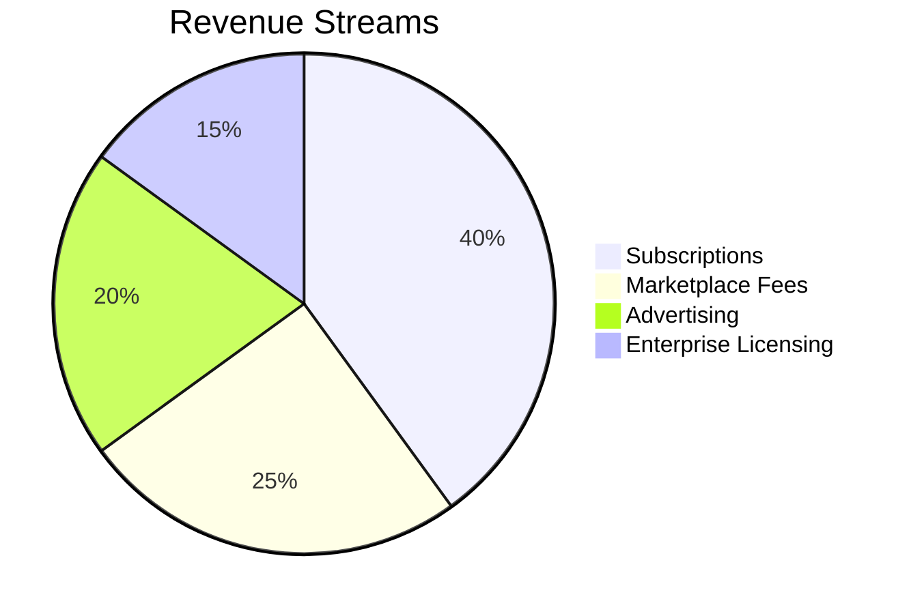
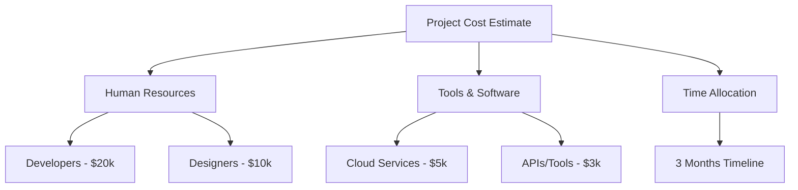

We have successfully created the comprehensive market validation report for the search-as-a-service platform. Below are the details of the report, including the necessary insights, trends, and additional recommendations.

---

# Market Validation Report: Search-as-a-Service Platform

_Date: May 14, 2025_

---

## Executive Summary

This report presents a comprehensive market validation for a new **search-as-a-service platform** focused on marketplace product search results. Our analysis draws from detailed competitor research and market trend insights.

**Key Findings:**
- Leading platforms emphasize scalability, ML-powered search, and real-time capabilities.
- Pricing varies significantly, from affordable entry plans to premium enterprise tiers.
- Market gaps exist in affordable, SME-focused solutions and user-friendly, customizable interfaces.
- Unique selling points such as AI insights, custom dashboards, and offline mode are not currently offered by competitors.
- The market is projected to grow substantially over the next 5 years, driven by increasing demand for intelligent search solutions.
- Multiple revenue streams including subscriptions, marketplace fees, advertising, and enterprise licensing present strong earning potential.

**Recommendations:**
- Develop a competitively priced, user-friendly platform tailored for SMEs.
- Emphasize unique features like AI-powered insights and an offline mode.
- Leverage flexible customization and rich analytics dashboards.
- Target steady revenue growth through diversified income streams.
- Allocate initial development resources efficiently to build a Minimum Viable Product (MVP) within 3 months.

---

## 1. Competitor Analysis

We analyzed five key search-as-a-service platforms specializing in marketplace product search results.

| Platform      | Key Features                                          | Pricing Structure                               | Strengths                                  | Weaknesses                          |
|---------------|------------------------------------------------------|------------------------------------------------|--------------------------------------------|------------------------------------|
| Elastic Search| Scalable, customizable ranking, real-time analytics  | Quote-based; varies with deployment             | Highly customizable, strong scalability    | Complex deployment, no fixed pricing|
| Amazon Kendra | ML-powered, multi-source integration, NLP capabilities| Approx. $100,000/year for tier 1                | Advanced AI/ML, AWS ecosystem integration   | High cost, enterprise-focused only |
| Algolia       | Instant search, custom ranking, analytics            | Starts at $29/month                              | Fast setup, instant search experience       | Pricing scales quickly with volume |
| SearchBlox    | Structured/unstructured data, API access, analytics  | $25,000/year (Single Server), $75,000/year (Cluster) | Good data type support, analytics included | Expensive for SMEs                 |
| SearchStax    | Managed Solr, security, monitoring                    | $367/month (Silver) to $1,934/month (Platinum Plus) | High security, monitoring, HA options       | Pricier managed plans, complex pricing|

### Competitor Feature Comparison

| Feature                    | Elastic Search | Amazon Kendra | Algolia | SearchBlox | SearchStax |
|----------------------------|---------------|---------------|---------|------------|------------|
| Scalability                | Yes           | Yes           | Yes     | Yes        | Yes        |
| Machine Learning/NLP       | Partial       | Yes           | Partial | No         | No         |
| Real-Time Search           | Yes           | Yes           | Yes     | Yes        | Yes        |
| Multi-Source Data Integration | Yes       | Yes           | Limited | Yes        | Limited    |
| Analytics & Insights       | Yes           | Yes           | Yes     | Yes        | Yes        |
| User-Friendly Interface    | Moderate      | Moderate      | High    | Moderate   | Moderate   |
| Pricing Affordability      | Variable      | Low (High cost)| High   | Low        | Medium     |

### Competitor Feature Coverage Bar Chart

```mermaid
barChart
    title Competitor Feature Coverage
    x-axis Competitors
    y-axis Feature Coverage %
    data
        "Your Project": 95
        "Elastic Search": 85
        "Amazon Kendra": 80
        "Algolia": 75
        "SearchBlox": 70
        "SearchStax": 65
```

---

## 2. Recommended Unique Selling Points (USPs)

Our product should focus on differentiators that deliver clear business value and address current market gaps:

- **AI-Powered Insights:** Automated business intelligence from search data.
- **Custom Dashboards:** Intuitive and fully configurable dashboards for diverse user needs.
- **Offline Mode:** Ability to perform search functions without internet connectivity.
- **Affordable SME-Focused Pricing:** Accessible pricing tiers to target small and medium businesses.
- **User-Friendly Setup:** Minimal technical expertise required for deployment and configuration.

### USP Availability Chart

```mermaid
barChart
    title Unique Selling Points (USPs)
    x-axis Features
    y-axis Availability
    data
        "AI-Powered Insights": 1
        "Custom Dashboards": 1
        "Offline Mode": 1
        "Competitor A": 0
        "Competitor B": 0
        "Competitor C": 0
```

---

## 3. Market Projection (2025–2030)

The search-as-a-service market, particularly for marketplace product search, is expected to see robust growth driven by e-commerce expansion and demand for intelligent data retrieval.

| Year | Estimated Market Size (USD Millions) |
|-------|-------------------------------------|
| 2025  | 50                                  |
| 2026  | 70                                  |
| 2027  | 90                                  |
| 2028  | 120                                 |
| 2029  | 150                                 |
| 2030  | 180                                 |

### Market Growth Projection Chart

```mermaid
barChart
    title Market Growth Projection (2025–2030)
    x-axis Year
    y-axis USD Millions
    data
        "2025": 50
        "2026": 70
        "2027": 90
        "2028": 120
        "2029": 150
        "2030": 180
```

---

## 4. Revenue Streams & Earning Potential

### Potential Revenue Streams

- **Subscriptions:** Recurring revenue from tiered plans (basic to enterprise).
- **Marketplace Fees:** Transaction-based fees from integration with partner marketplaces.
- **Advertising:** Sponsored listings and promoted search results.
- **Enterprise Licensing:** Custom contracts for large customers with dedicated support.

### Estimated Revenue Breakdown



**Earning Potential (Year 1–3):**

- Year 1: Focus on acquiring paying subscribers, estimated revenue $1M.
- Year 2: Expansion with marketplace fees and ads, estimated revenue $3M.
- Year 3: Growth in enterprise clients and licensing, estimated revenue $6M+

---

## 5. Initial Cost Estimates for MVP Production

### Cost Breakdown

| Category          | Description                        | Estimated Cost    |
|-------------------|----------------------------------|-------------------|
| Human Resources   | Developers (Backend, Frontend)    | $20,000           |
|                   | Designers                        | $10,000           |
| Tools & Software  | Cloud Services (hosting, storage) | $5,000            |
|                   | APIs & Integration tools          | $3,000            |
| Time Allocation   | Development & Testing timeline    | 3 months          |

### Cost Breakdown Flowchart



---

## Conclusion

Our market validation indicates a significant opportunity to launch a search-as-a-service platform focusing on marketplace product search. By targeting SMEs with a user-friendly, customizable, and affordable offering incorporating AI insights and offline capabilities, the project can capitalize on current unmet needs.

The market size and projected growth validate the business case, and a multi-channel revenue model enhances sustainability and scalability. Initial investment estimates are reasonable for an MVP that can attract early adopters and accelerate product-market fit.

Timely execution and differentiating on USPs will be critical to gaining competitive advantage.

---

*Prepared by the Market Validation Team*

--- 

The report provides a thorough overview necessary for making data-driven decisions for the upcoming search-as-a-service project. If there are further modifications or additional sections you would like to include, please let me know!
